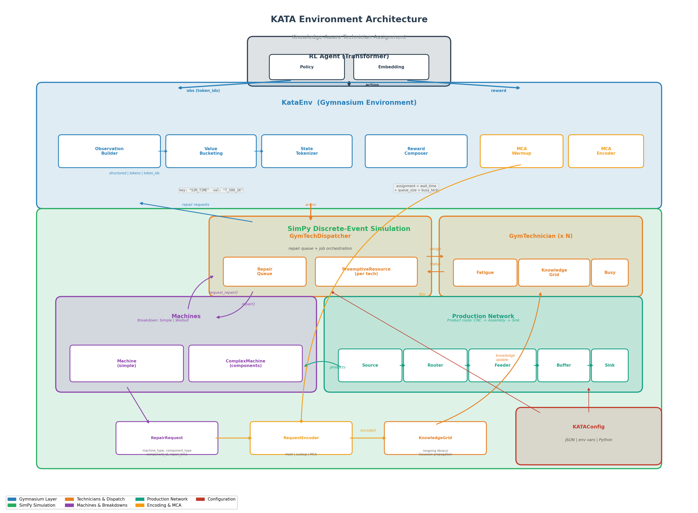

# KATA - Knowledge-Aware Technician Assignment

## Overview

KATA is a **Gymnasium-compatible reinforcement learning environment** built on top of a **SimPy discrete-event simulation** of a manufacturing plant. The agent's task is to assign technicians to broken machines. Each technician has a **knowledge grid** (spatial representation of repair expertise) and a **fatigue model** that affect repair time. The environment is designed for training Transformer-based RL agents to learn optimal technician assignment policies.

The simulation models a complete production line: products flow through machines following a defined route, machines break down stochastically, and the RL agent decides which technician handles each repair. The agent receives observations about the current state of the factory and earns rewards based on assignment efficiency.

### Key design principles

- **Config-driven**: every hyperparameter (fatigue rates, breakdown models, reward weights, observation format) is set through a single `KATAConfig` object loaded from JSON, environment variables, or Python code.
- **Event-driven RL loop**: the environment only asks for an action when a new repair request appears, rather than stepping at a fixed time interval.
- **Bounded token vocabulary**: observations use key-value token pairs with bucketed numerical values, keeping the vocabulary finite and suitable for Transformer embedding layers.
- **Pluggable encoder**: the mapping from repair requests to knowledge grid coordinates is abstracted behind a `RequestEncoder` protocol, with hash-based, lookup-based, and MCA-based implementations.

---

## Architecture



### Production network

Products are generated by **Sources** at regular intervals. Each product carries a **route** - an ordered list of machine types it must visit (e.g. `["CNC", "Assembly"]`). A central **Router** reads the product's next machine type and forwards it to the corresponding type-specific queue. A **MachineFeeder** distributes products from each type queue to individual machines of that type using round-robin. After processing, products are conveyed back to the router for the next step, or to a **Sink** if the route is complete.

All transport between entities is handled by SimPy **Buffers** (wrappers around `simpy.Store`).

### Machines and breakdowns

Two machine types exist:

- **Machine** - a simple machine with a single breakdown process. At each simulation time step, the breakdown driver rolls against a failure probability. If the machine breaks, it interrupts processing, creates a `RepairRequest`, and waits for repair.
- **ComplexMachine** - extends Machine with a list of **MachineComponents**, each with its own breakdown process and repair time. When a component fails, the request includes which specific component failed.

Two breakdown models are available:

| Model | Description |
|---|---|
| **SimpleBreakdownProcess** | Constant failure probability per time step (separate rates for working and idle states) |
| **WeibullBreakdownProcess** | Age-dependent hazard function `h(t) = (shape/scale) * (t/scale)^(shape-1)`, modelling wear-out; resets on repair |

### Technicians

Each **GymTechnician** has:

- **Fatigue** - accumulates during work (`fatigue_lambda`), recovers during idle time (`fatigue_mu`). Clamped to [0, 1]. Higher fatigue increases repair time via an exponential multiplier `exp(-alpha * fatigue)`.
- **Knowledge grid** - a spatial grid (from the `ongoing` library) where each cell represents expertise on a specific failure type. When a technician completes a repair, knowledge increases at the grid coordinate corresponding to that failure type, propagating to nearby cells via Gaussian diffusion. Higher knowledge reduces repair time.
- **Disruptions** - stochastic events (e.g. sick leave) that pre-empt the technician's availability via SimPy's `PreemptiveResource`.

Effective repair time is computed as:

```
effective_time = max(1, base_repair_time * knowledge_multiplier * fatigue_multiplier)
```

where `knowledge_multiplier` decreases with expertise and `fatigue_multiplier` increases with tiredness.

### Tech dispatcher

The **GymTechDispatcher** is the bridge between the RL agent and the simulation:

1. Machines call `request_repair(machine)` when they break down, creating a `RepairRequest` and adding it to the repair queue.
2. The Gym environment pops requests from the queue and presents them to the agent.
3. The agent selects a technician index (the action).
4. The environment calls `start_repair(tech_id, request)`, which launches a SimPy process: **wait for technician availability** -> **travel** -> **repair** -> **signal completion**.

### Request encoding

The `RequestEncoder` protocol maps a `RepairRequest` to a coordinate on the technician's knowledge grid. Three implementations exist:

| Encoder | How it works |
|---|---|
| **HashEncoder** | Deterministic hash of `(machine_type, component_type)`. No fitting required. |
| **LookupEncoder** | Explicit mapping table with hash fallback for unknown keys. |
| **MCAEncoder** | Multiple Correspondence Analysis (via `prince`) on categorical features (machine type, component type, component ID, repair time bucket). Must be fitted on collected requests during a warmup phase. |

---

## Gymnasium environment

### Action space

`Discrete(n_technicians)` - the agent selects which technician to assign to the current repair request.

### Observation representations

Three formats are available, controlled by `observation_representation` in `GymEnvConfig`:

#### `"structured"` (default)

A dictionary of numpy arrays:

| Key | Shape | Description |
|---|---|---|
| `sim_time` | `(1,)` float32 | Current simulation clock |
| `has_open_ticket` | `(1,)` int8 | Whether a repair request is pending |
| `ticket_created_at` | `(1,)` float32 | When the current ticket was created |
| `ticket_machine_id` | `(1,)` float32 | Machine ID of the current ticket |
| `technician_busy` | `(n_techs,)` int8 | Binary vector of technician availability |
| `technician_fatigue` | `(n_techs,)` float32 | Fatigue level per technician (optional) |
| `pending_queue_size` | `(1,)` float32 | Number of queued repair requests (optional) |

#### `"tokens"`

A tuple of string tokens using **key-value pairs**. Each field is emitted as a key token followed by a value token. Numerical values are bucketed into categorical tokens to keep the vocabulary bounded:

| Value type | Buckets |
|---|---|
| **Time** | `T_NONE`, `T_0_50`, `T_50_200`, `T_200_500`, `T_500_1K`, `T_1K_5K`, `T_5K+` |
| **Ratio** [0, 1] | `R_0`, `R_LOW`, `R_MEDLOW`, `R_MED`, `R_MEDHIGH`, `R_HIGH` |
| **Count** | `C_0`, `C_1`, `C_2_3`, `C_4_5`, `C_6_10`, `C_11_20`, `C_20+` |
| **Boolean** | `TRUE`, `FALSE` |
| **Categorical** | Literal string (e.g. `CNC`, `Assembly`) |

Example observation (factory_level mode):

```
SIM_TIME         -> T_500_1K
HAS_TICKET       -> TRUE
TICKET_AGE       -> T_0_50
TICKET_MACHINE_TYPE -> CNC
MACHINE_TYPE     -> CNC
MACHINE_BROKEN   -> TRUE
MACHINE_TOTAL_PROCESSED -> C_4_5
FACTORY_MACHINES -> C_2_3
FACTORY_BROKEN   -> C_1
TECH_0  BUSY     -> FALSE
TECH_0  FATIGUE  -> R_MEDLOW
TECH_1  BUSY     -> TRUE
TECH_1  FATIGUE  -> R_HIGH
```

Three levels of detail are available via `observation_mode`:
- `ticket_only` - only current ticket info and per-tech status
- `broken_machine` - adds the broken machine's state
- `factory_level` - adds aggregate factory statistics

#### `"token_ids"`

The token observation passed through the **StateTokenizer**, producing a fixed-length `int64` array. Special tokens: `<PAD>` (0), `<UNK>` (1), `<BOS>` (2), `<EOS>` (3). This is the format designed for Transformer input.

### Reward

The reward is a weighted sum of independent components, each with an `enabled` flag and a `coefficient`:

| Component | Raw value | Description |
|---|---|---|
| `assignment` | `assignment_reward` (config) | Constant reward for making an assignment |
| `wait_time` | `-ticket_wait_time_penalty * (sim_time - ticket_created_at)` | Penalizes delayed assignments |
| `queue_size` | `-pending_queue_size` | Penalizes queue buildup |
| `busy_technician` | `-1` if assigned tech is busy, else `0` | Penalizes assigning busy technicians |

Final reward: `sum(coefficient_i * raw_value_i for each enabled component)`

The `info` dict includes a `reward_breakdown` showing each component's contribution.

### Episode termination

An episode ends when any of these conditions is met:
- `episode_step >= max_episode_steps`
- `sim_time >= max_sim_time`
- No more events in the simulation and no pending requests

---

## MCA warmup

When `use_mca_encoder=True`, the first call to `reset()` runs a warmup phase:

1. A `WarmupEnv` (subclass of `KataEnv`) is created with `observation_representation="tokens"` and `use_mca_encoder=False` (to avoid recursion).
2. The warmup runs the simulation for `warmup_steps` steps under a **least-busy, least-fatigued** heuristic policy.
3. All `RepairRequest` objects are collected and their categorical features extracted: `(machine_type, component_type, component_id, repair_time_bucket)`.
4. A `prince.MCA` is fitted on the collected feature matrix.
5. All token observations seen during warmup are passed through the `StateTokenizer` to build the vocabulary.
6. The tokenizer is frozen (unseen tokens map to `<UNK>`).
7. The fitted `MCAEncoder` replaces the global `ENCODER` singleton.

After warmup, technicians' knowledge updates use MCA-derived coordinates instead of hash-based ones, creating a more semantically meaningful knowledge space.

---

## Scenario construction

The `ScenarioBuilder` takes a `KATAConfig` and wires together the full SimPy simulation:

```
Source ──> Router ──> [type queue] ──> MachineFeeder ──> Machine input buffer
                                                              │
                                                         Machine (process)
                                                              │
                                                     Machine output buffer ──> Conveyor ──> Router
                                                                                              │
                                                                                       (next step or Sink)
```

For each machine type, the builder creates:
- Input and output buffers
- Either a `Machine` or `ComplexMachine` (if components are defined in config)
- A type-specific queue and feeder

The dispatcher manages all technicians, their `PreemptiveResource` instances, and the repair queue.

---

## Configuration

All settings live in `KATAConfig`, a `pydantic-settings` model that loads from (in priority order):
1. Python kwargs
2. `KATA_`-prefixed environment variables
3. JSON file at `KATA_CONF_PATH` (defaults to `run_configs/config.json`)
4. Hard-coded defaults

### Key config sections

| Section | Class | Controls |
|---|---|---|
| `technicians` | `dict[str, TechnicianConfig]` | Per-technician fatigue rates, knowledge grid shape, learning rates |
| `machines` | `dict[str, MachineConfig]` | Machine types, process times, optional components with breakdown models |
| `products` | `dict[str, ProductConfig]` | Product types and their processing routes |
| `sim` | `SimEnvConfig` | Disruption parameters, repair switches, global technician settings |
| `gym` | `GymEnvConfig` | Episode limits, observation format, reward weights, MCA/tokenizer settings |

---

## File structure

```
src/kata/
├── env.py                   # KataEnv - main Gymnasium environment
├── env_warmup.py            # WarmupEnv - MCA warmup subclass
├── scenario.py              # ScenarioBuilder - config-driven factory construction
├── core/
│   ├── config.py            # KATAConfig and all sub-configs
│   └── tokenizer.py         # StateTokenizer - dynamic vocabulary tokenizer
├── entities/
│   ├── encoder/
│   │   ├── base.py          # RequestEncoder protocol, Hash/Lookup encoders
│   │   └── mca_encoder.py   # MCA-based encoder (prince)
│   ├── technicians/
│   │   └── GymTechnician.py # Technician with fatigue + knowledge grid
│   ├── tech_dispatcher/
│   │   └── GymTechDispatcher.py  # Repair queue + job orchestration
│   ├── machines/
│   │   ├── machine.py       # Simple machine with breakdown
│   │   └── complex_machine.py  # Multi-component machine
│   ├── components/
│   │   └── component.py     # Individual machine component
│   ├── requests/
│   │   └── RepairRequest.py # Repair ticket
│   ├── buffers/buffer.py    # SimPy Store wrapper
│   ├── sources/source.py    # Product generator
│   ├── sinks/sink.py        # Product consumer
│   ├── routers/router.py    # Product routing
│   ├── machine_feeder/      # Round-robin machine feeding
│   └── products/product.py  # Product with route
└── features/
    └── breakdown/
        └── simple_breakdown.py  # Simple + Weibull breakdown models
```
